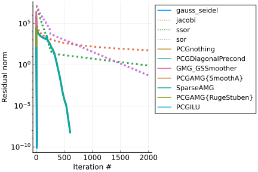

# LidJul.jl

<!--


[](https://travis-ci.org/triscale-innov/LidJul.jl)
[](http://codecov.io/github/triscale-innov/LidJul.jl?branch=master)-->

*Disclaimer: this is a Work In Progress that explores the performance of different different solvers for Poisson's equation. Parts of this work may be included as hands-on sessions in TriScale innov's future professional training programs.*


## A simple Geometric Multi-Grid Julia implementation for a 2D Poisson's equation. 
This Julia repo compares the performance of different linear solvers available in classical Julia packages with a simple *Geometric Multi Grid* (GMG) solver adapted from *Harald Köstler*'s implementation:

"Multigrid HowTo: A simple Multigrid solver in C++ in less than 200 lines of code"
https://www10.cs.fau.de/publications/reports/TechRep_2008-03.pdf

The `src/poisson2DGMG` and `src/GSSmoother.jl` files contain the Julia implementation of a solver for Poisson's equation defined on a 2D unit square with `n x n` steps and a basic FD scheme. Boundary conditions can be chosen to be of `Dirichlet` or `Neumann` type for the 4 edges of the square (left,right,bottom,top). One can launch the
resolution of the Poisson's equation with a collection of solvers via the command (from this directory):


```julia
include("test/poisson2D.jl")
```

By default the solver is launched for `n=128` and `DNDN` boundary conditions. These values can be modified in the `go()` function defined in `test/poisson2D.jl`. Note that `n` must be a power of two.

```
function go()
    n=128 #Choose a power of two
    #Choose boundary conditions 
    # bc=(neumann,neumann,neumann,neumann)
    bc=(dirichlet,neumann,dirichlet,neumann)
    ...
```


The code should return a collection of measurements corresponding to the CPU time required by each solver, the number of iterations for the iterative solvers as well as the corresponding residual. The CPU time the `init_time` corresponds to the time required by the solver construction for a given matrix, and the `solver_time` corresponds to the time required by the solution of a linear system with a given RHS.


```
┌────────────────────┬───────────┬─────────────┬────────────┬───────────┬─────────┐
│ solver             │ init_time │ solver_time │ Total Time │ residual  │ niters  │
├────────────────────┼───────────┼─────────────┼────────────┼───────────┼─────────┤
│ gauss_seidel       │ 8.900E-08 │ 4.492E-03   │ 4.492E-03  │   NaN     │ 10      │
│ GMG_GSSmoother     │ 7.034E-05 │ 5.264E-03   │ 5.335E-03  │ 1.148E-10 │ 17      │
│ TTSolver           │ 6.101E-03 │ 3.554E-04   │ 6.457E-03  │ 4.886E-11 │ nothing │
│ PCGAMG{SmoothA}    │ 1.383E-02 │ 4.145E-02   │ 5.529E-02  │ 1.916E-09 │ 16      │
│ PCGAMG{RugeStuben} │ 2.825E-02 │ 4.817E-02   │ 7.643E-02  │ 6.521E-10 │ 12      │
│ SparseLU           │ 9.333E-02 │ 6.262E-03   │ 9.959E-02  │ 1.748E-12 │ nothing │
│ PCGnothing         │ 5.100E-08 │ 1.431E-01   │ 1.431E-01  │ 5.959E-09 │ 605     │
│ SparseAMG          │ 8.246E-02 │ 6.945E-02   │ 1.519E-01  │ 6.521E-10 │ 12      │
│ jacobi             │ 5.700E-08 │ 3.014E-01   │ 3.014E-01  │ 9.707E+01 │ 2000    │
│ PCGILU             │ 2.629E-01 │ 7.272E-02   │ 3.356E-01  │ 4.687E-10 │ 8       │
│ sor                │ 3.000E-08 │ 4.922E-01   │ 4.922E-01  │ 6.332E+01 │ 2000    │
│ ssor               │ 3.100E-08 │ 9.461E-01   │ 9.461E-01  │ 6.332E+01 │ 2000    │
│ PCGDiagonalPrecond │ 2.945E-04 │ 5.147E+00   │ 5.148E+00  │ 6.132E-09 │ 602     │
└────────────────────┴───────────┴─────────────┴────────────┴───────────┴─────────┘
```
One can see in particular that the present GMG solver (`GMG_GSSmoother`) outperforms the available AMG solvers (Algebraic Multi-Grid) by a large factor (x10). The TTSolver is a direct Poisson solver which is restricted to separable Poisson coefficients. 

The code also produces some convergence curves and bar charts for comparing CPU times. 





Note that the full Neumann case can be treated by several iterative methods (including the present GMG). The direct SparseLU is also able to treat this case via a regularization applied to the Laplacian operator. 

## A simple CFD application of the solver (Lid Cavity). 

Finally the GMG solver is used in a Julia translation of *Benjamin Seibold*'s classical `MIT18086_NAVIERSTOKES` matlab implementation that simulates a square lid cavity. See the details here: 
[http://math.mit.edu/~gs/cse/codes/mit18086_navierstokes.pdf](http://math.mit.edu/~gs/cse/codes/mit18086_navierstokes.pdf)


From this directory run the following command to launch this 2D CFD simulation :


```julia
include("test/mit_implicit.jl")
```


